# CSV Data Pipeline on AWS

Event-driven pipeline. Upload a CSV → get a cleaned CSV + a queryable table, automatically.

*note: timestamps in images may differ since there were multiple runs over several days which would result in screenshot redundancies.*

## One-glance summary

- **Trigger**: file upload to S3
- **Steps**: Lambda → Glue Workflow (Crawler → Conditional Trigger → Glue ETL Job, Python Shell)
- **Output**: cleaned CSV in a second bucket + a Glue Data Catalog table, queryable in Athena
- **Transform rule**: standardize nulls — numeric columns → `0`, text columns → `"UNKNOWN"`
- **IAM**: 2 roles, each scoped to only what its function needs
- **Logging**: CloudWatch, automatic for every Lambda and Glue run — plus the Workflow's own run history gives a single visual graph of every step

## Architecture

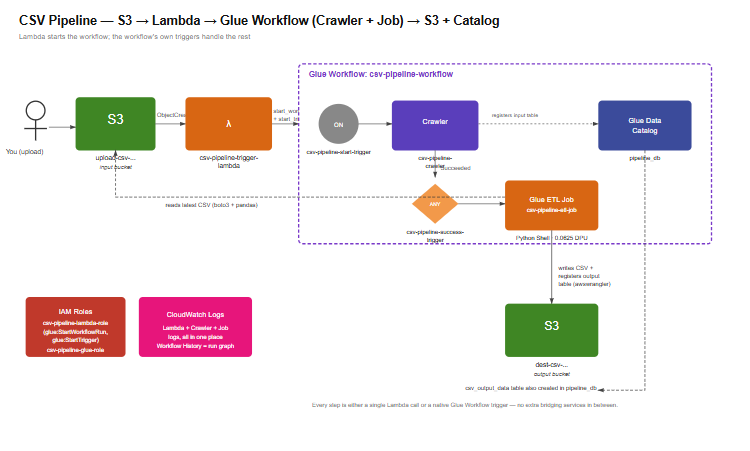

## What each step does

| Step | Service | Name | Does |
|---|---|---|---|
| 1 | S3 | `upload-csv-1233219898` | Landing zone for raw CSVs |
| 2 | Lambda | `csv-pipeline-trigger-lambda` | Fires on upload, starts the Glue Workflow |
| 3 | Glue Workflow | `csv-pipeline-workflow` | Contains the two triggers below — one object, one run history |
| 3a | Trigger (On Demand) | `csv-pipeline-start-trigger` | Fired by Lambda, starts the crawler |
| 3b | Glue Crawler | `csv-pipeline-crawler` | Scans the input bucket, infers schema, creates a Catalog table |
| 3c | Trigger (Conditional) | `csv-pipeline-success-trigger` | Watches the crawler for state Succeeded, starts the job |
| 4 | Glue Job | `csv-pipeline-etl-job` | Reads latest CSV, standardizes nulls, writes output + updates Catalog |
| 5 | S3 | `dest-csv-1233219898` | Landing zone for cleaned CSVs |
| 6 | Glue Catalog | `pipeline_db.csv_output_data` | Queryable table over the cleaned data |

## Repo contents

```
lambda/
  csv-pipeline-trigger-lambda.py     Starts the Glue Workflow on upload
glue/
  csv-pipeline-etl-job.py            The Python Shell ETL script
iam/
  csv-pipeline-lambda-role-policy.json     Lambda's permissions
  csv-pipeline-glue-role-policy.json       Crawler + job's permissions
screenshots/                        Screenshots for verification and documentation                                             
```

## File-by-file explanation

**`lambda/csv-pipeline-trigger-lambda.py`**
- Runs on every S3 upload to the input bucket
- Two calls only: `glue.start_workflow_run()` then `glue.start_trigger()` — the second call actually fires the workflow's starting trigger
- Does not touch the file itself — crawling and reading happen later

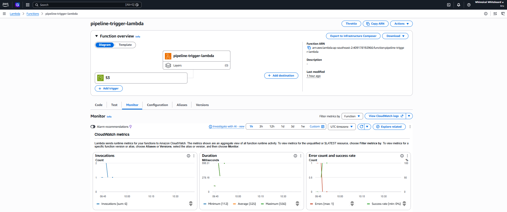

**`glue/csv-pipeline-etl-job.py`**
- Finds the most recently uploaded CSV in the input bucket
- Reads it with pandas
- Fills nulls per column type — numeric columns get `0`, text columns get `"UNKNOWN"`
  - Important: a single blanket `fillna("UNKNOWN")` across all columns breaks numeric columns — the write step can't cast the string into a number. Filling by dtype avoids that.
- Writes the cleaned CSV to the output bucket
- Registers/updates the `csv_output_data` table in the Catalog in the same step, via `awswrangler`

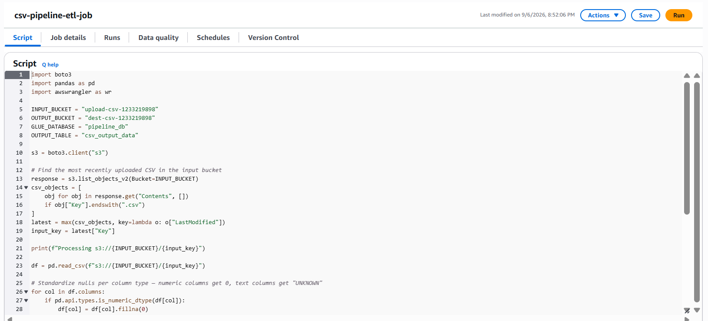

**`iam/*.json`**
- Each file documents one role's actual policy, plus a short note on why it needs what it needs
- No role has more permission than its one job requires.

## Least privilege, in short

- `csv-pipeline-lambda-role` → can start one workflow and fire one trigger, nothing else
- `csv-pipeline-glue-role` → read-only on the input bucket, read/write/delete only on the output bucket, Catalog access scoped to one database

## Verification of successful run!

1. Upload a CSV to the input bucket

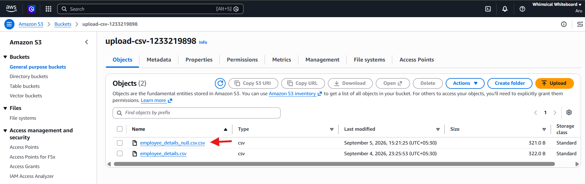

   *Original CSV:*

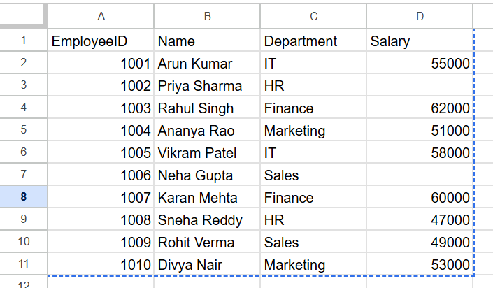

2. Lambda → Monitor tab → invocation appears, no errors


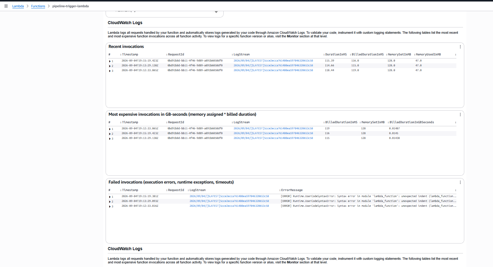

3. Glue Workflow → History tab → the run's graph, all four nodes green

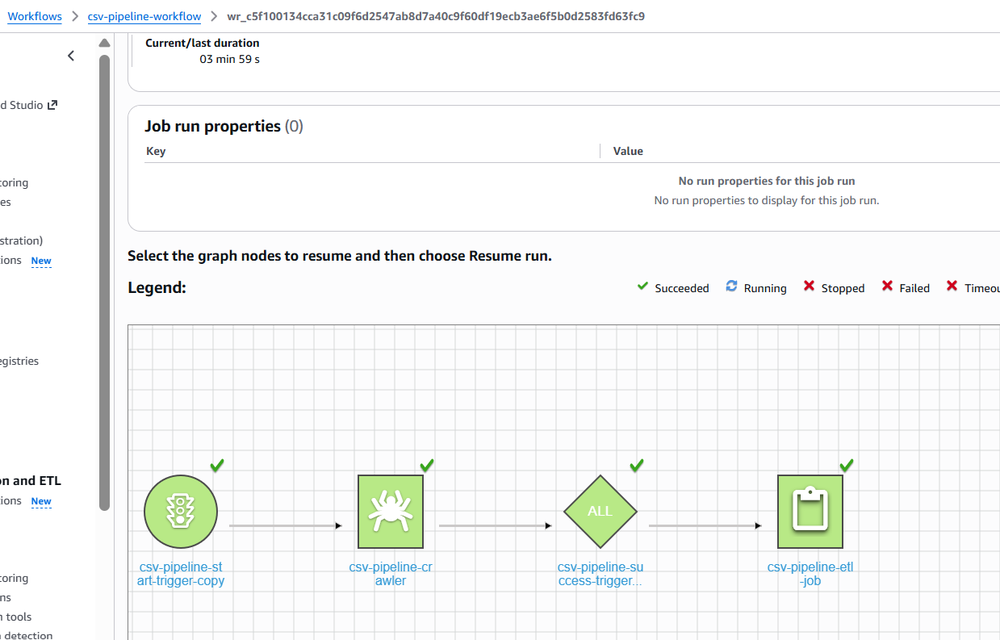

4. Glue Crawler → Runs tab → status Succeeded

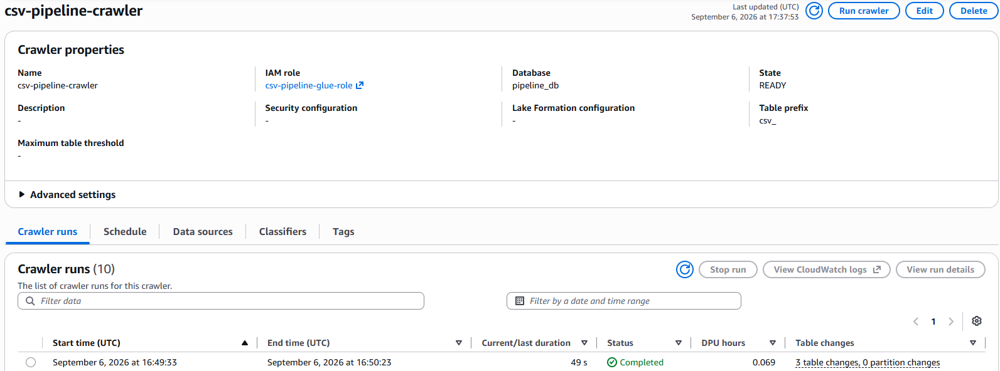

5. Glue Job → Runs tab → status Succeeded, and its details show **Triggered by: csv-pipeline-success-trigger**

   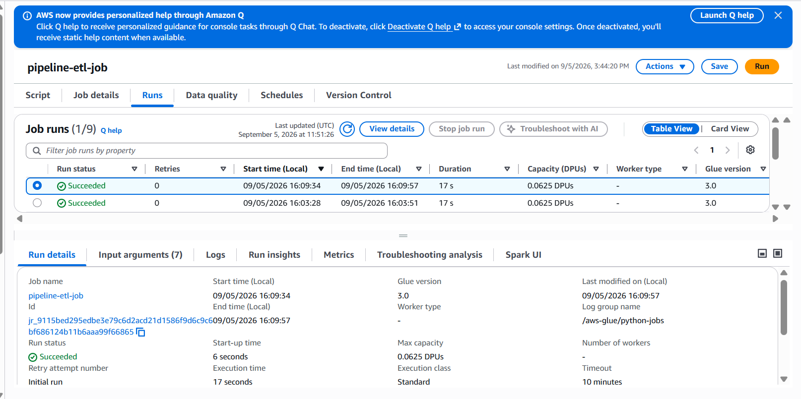
   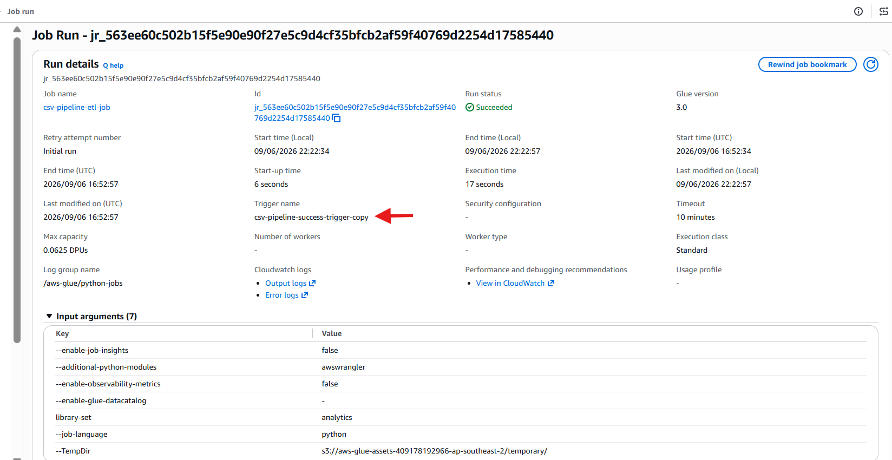

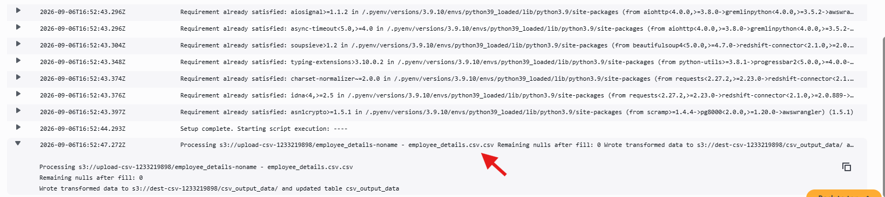

6. Output bucket → cleaned CSV appears

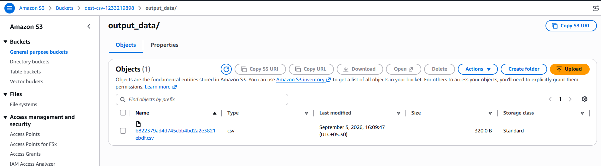

7. Glue Catalog → `csv_output_data` table exists with the right schema

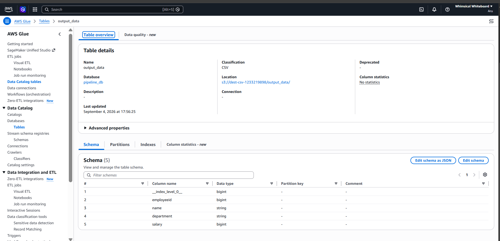

8. Athena → `SELECT * FROM csv_output_data;` → nulls are standardized, row count matches input

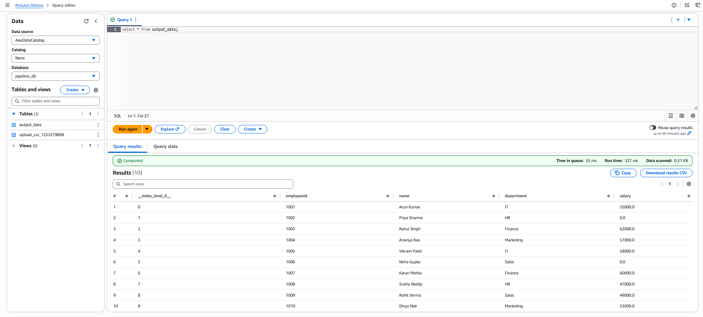

## GLUE WORKFLOW

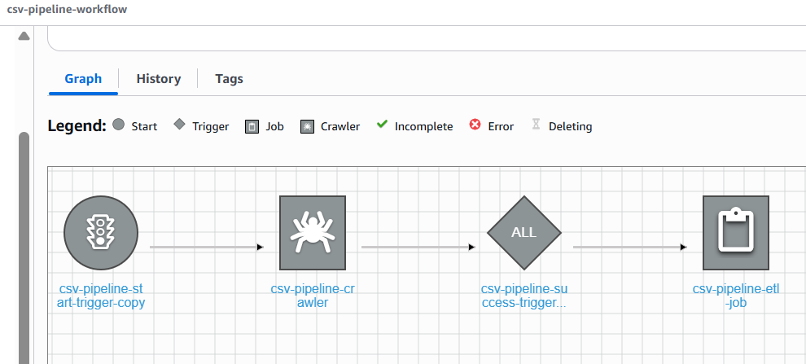

*CHANGED THE CSV TO ENSURE ETL WAS RUNNING AS EXPECTED (added a blank record under NAME column)*

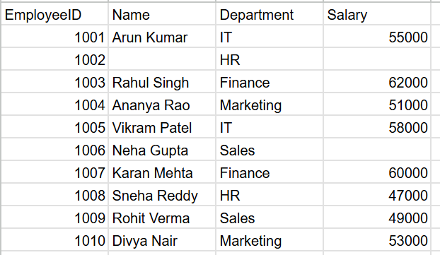

*OBSERVATION: The blank name cell is changed to UNKNOWN*

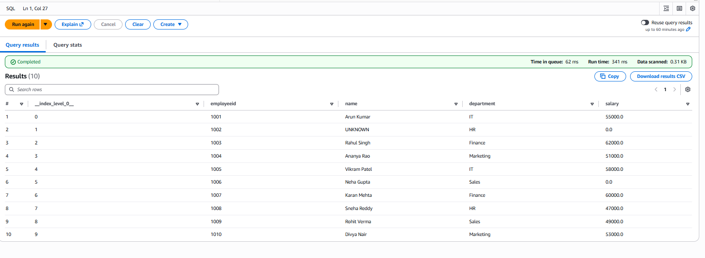


## CI/CD — trigger the pipeline from GitHub

A CSV can also enter this pipeline by being pushed to a GitHub repo, instead of uploaded through the S3 console directly. A GitHub Actions workflow watches for new CSVs and copies them into the input bucket — everything downstream (Lambda → Glue Workflow → output) runs exactly the same either way.

```
Push a CSV to GitHub (folder: incoming-csvs/)
    → GitHub Actions workflow triggers
        → Authenticates to AWS using an IAM user's access keys
            → Checks that upload-csv-1233219898 exists, creates it if not
                → Diffs the commit to find which CSVs actually changed
                    → Uploads each changed CSV to upload-csv-1233219898
                        → Existing S3 event notification fires
                            → csv-pipeline-trigger-lambda → Glue Workflow → same as every other upload
```

The workflow only fires on pushes to `main` that touch `incoming-csvs/**.csv` (see `on.push.paths` in the yml) - unrelated commits won't trigger it. It also only uploads files that actually changed in that push (via `git diff HEAD^ HEAD`), not every CSV in the folder.

### One-time setup

**1. Create the IAM user**
- IAM → Users → Create user → name: `csv-pipeline-github-actions-user`
- Programmatic access only, no console access

**2. Attach this inline policy** (`iam/github-actions-user-policy.json`):
```json
{
	"Version": "2012-10-17",
	"Statement": [
		{
			"Effect": "Allow",
			"Action": "s3:PutObject",
			"Resource": "arn:aws:s3:::upload-csv-1233219898/*"
		},
		{
			"Effect": "Allow",
			"Action": [
				"s3:HeadBucket",
				"s3:CreateBucket",
				"s3:ListBucket"
			],
			"Resource": "arn:aws:s3:::upload-csv-1233219898"
		}
	]
}
```
- Can only upload into the input bucket — no read, no delete, no other bucket, no Glue/Lambda access at all

- Note: the workflow also checks whether `upload-csv-1233219898` exists (`aws s3api head-bucket`) and creates it if not. The inline policy below only grants `s3:PutObject` on the bucket's objects, which is enough if the bucket already exists - if it doesn't, also grant this user `s3:HeadBucket` and `s3:CreateBucket` on the bucket itself, or pre-create the bucket so the workflow's check just passes through.

**3. Generate access keys**
- Same user → Security credentials tab → Create access key → use case: **Third-party service**
- Copy both the Access key ID and Secret access key immediately — the secret is shown only once

**4. Store the keys as GitHub repo secrets**
- Repo → Settings → Secrets and variables → Actions → New repository secret
- Add `AWS_ACCESS_KEY_ID` and `AWS_SECRET_ACCESS_KEY`

**5. Create the watched folder**
- Add an `incoming-csvs/` folder to the repo — this is the only path the workflow reacts to

**6. Add the workflow file + commit and push**
- Path must be exactly `.github/workflows/upload-csv-to-s3.yml` — GitHub only looks in `.github/workflows/`


### Testing it

1. Add a fresh CSV to `incoming-csvs/`, commit, push
2. GitHub repo → **Actions** tab → confirm the run shows green
3. S3 → input bucket → confirm the file landed there
4. The rest of the pipeline runs exactly as it does for a console upload

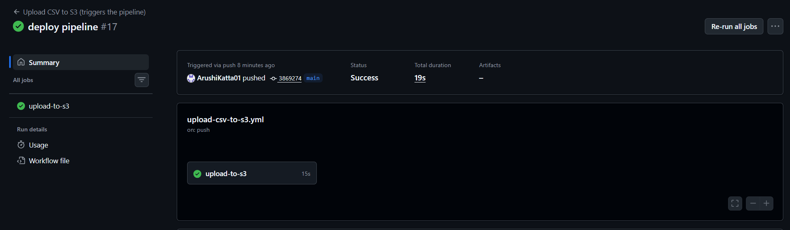

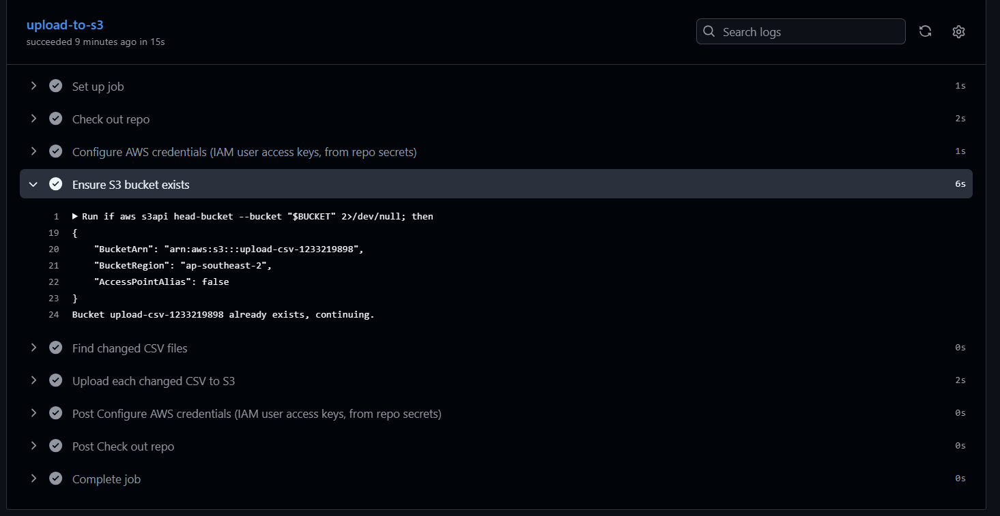


## Issues fixed along the way

- **AccessDenied on s3:DeleteObject** — `mode="overwrite"` in the write step deletes the old file before writing the new one. Fixed by adding `s3:DeleteObject` to `csv-pipeline-glue-role`'s output bucket permission.
- **Workflow said "doesn't have any starting trigger"** — the trigger existed but wasn't activated, or wasn't actually attached to this workflow. Fixed by building both triggers directly inside the workflow's own Graph tab (not the standalone Triggers page), and clicking **Activate** on each one immediately after creating it.
- **Crawler "already running"** — traced back to Lambda silently auto-retrying a failed invocation up to 2 extra times, each retry starting a new colliding workflow run. Turned off Lambda's automatic retries (Configuration → Asynchronous invocation → Maximum retry attempts → 0).
- **Failed to update jobcreate: AccessDeniedException: Account 549610931650 is denied access.** - created a new account and created the workflow in the same. I was able to create and run Glue Jobs in the new account.
- **A problem I've been facing** is when running the pipeline automatically: SOMETIMES the workflow graph would show that the crawler has failed. However the table and csv would be updated properly when checking the logs and verifying in the QUERY EDITOR IN ATHENA. 
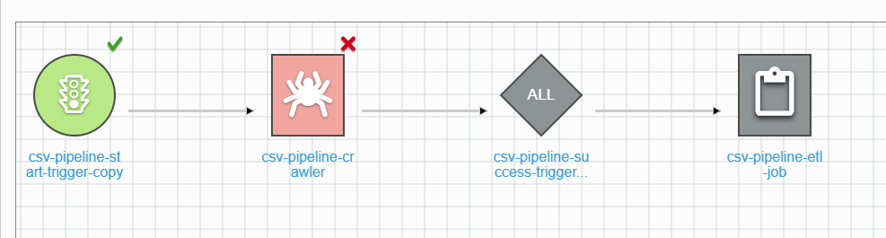
At first it looked like a backend issue. Then I inspected the existing triggers and realized the 'Associated Workflow' field was empty. 
Solution -> Re-creating the triggers in the workflow graph, and defining the jobs/crawlers to watch solved the issue. 
Now, activating the trigger actually changes the 'Status' to ACTIVATED!


